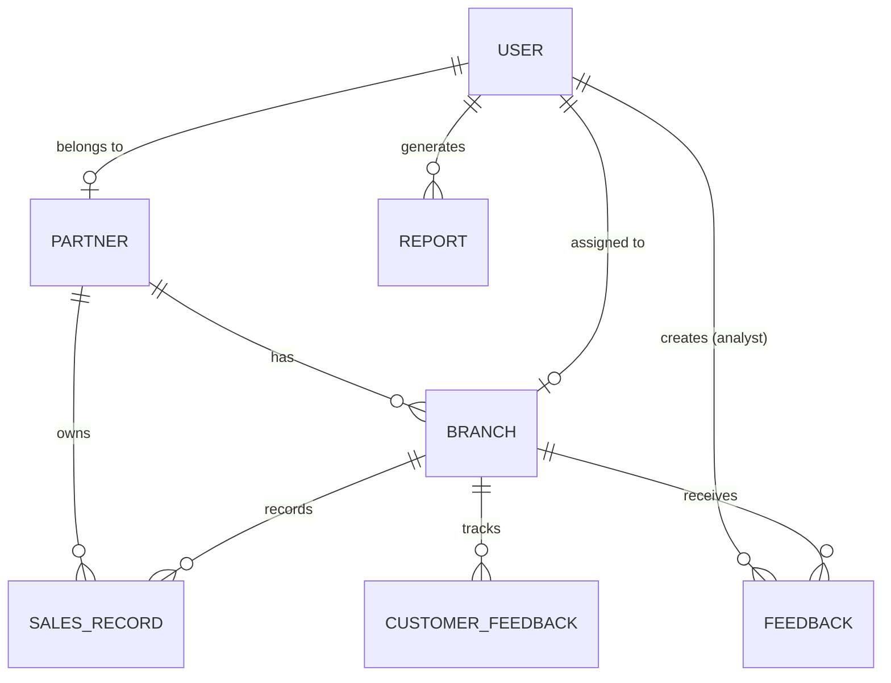

# 🏢 Partnership Insights Hub

<div align="center">

**A production-ready SaaS analytics platform for monitoring and managing partnership performance**


</div>

---

## 📖 Table of Contents

- [Overview](#-overview)
- [Features](#-features)
- [Architecture](#-architecture)
- [Tech Stack](#-tech-stack)
- [Project Structure](#-project-structure)
- [Getting Started](#-getting-started)
- [Environment Variables](#-environment-variables)
- [API Reference](#-api-reference)
- [Authentication](#-authentication)
- [Database Schema](#-database-schema)
- [Available Scripts](#-available-scripts)
- [Deployment](#-deployment)
- [Contributing](#-contributing)
- [License](#-license)

---

## 🌟 Overview

**Partnership Insights Hub** is an enterprise-grade analytics dashboard designed for organizations to manage, monitor, and analyze partnership performance across multiple branches. It features **role-based access control (RBAC)** with two distinct user types:

- **Analysts** — Global visibility into all partners, branches, sales data, and feedback
- **Partners** — Personalized dashboards with sales submission, feedback, and performance tracking

The platform supports **Google OAuth authentication**, **PDF report generation**, **real-time analytics**, **dark/light theming**, and **CSV data export**.

---

## ✨ Features

### 🔐 Authentication & Security
- **Google OAuth 2.0** — Sign in and sign up with verified Google accounts
- **JWT-based sessions** — Secure token-based authentication with configurable expiry
- **Role-Based Access Control (RBAC)** — Analyst and Partner roles with granular route protection
- **Google-verified signup** — Registration requires Google OAuth verification (no dummy emails)
- **Password hashing** — bcrypt-based password security

### 📊 Analyst Features
- **Global Dashboard** — Aggregated KPIs across all partners and branches
- **Partner Management** — View, filter, and manage all registered partners
- **Analytics Page** — Interactive charts and visualizations with date-range filtering
- **Report Generation** — Generate and download detailed PDF sales reports
- **Feedback System** — Send daily performance feedback to branches, reply to partner queries
- **User Management** — View all registered users and their roles
- **Performance Monitoring** — Branch-level performance comparison and trend analysis

### 🤝 Partner Features
- **Personalized Dashboard** — Branch-specific KPIs and performance metrics
- **Daily Sales Submission** — Log product sales data with quantity, amount, and profit
- **Sales History** — View complete transaction history with filtering and search
- **Customer Feedback** — Submit daily customer feedback with ratings and comments
- **Daily Feedback View** — View analyst feedback and respond to queries
- **Performance Tracking** — Track branch performance trends over time

### 🎨 UI/UX
- **Dark / Light Theme** — System-aware theme with manual toggle (powered by `next-themes`)
- **Responsive Design** — Mobile-friendly layouts across all pages
- **Toast Notifications** — Real-time feedback with Sonner toast notifications
- **Modern UI Components** — Built with shadcn/ui + Radix UI for accessibility
- **Interactive Charts** — Powered by Recharts with hover tooltips and animations

### 📥 Data & Exports
- **CSV Export** — Download sales history and feedback data as CSV files
- **PDF Reports** — Landscape A4 reports with cover page, metric boxes, branch/product tables, and transaction logs
- **Date-Range Filtering** — Filter data across customizable time periods

---

## 🏗️ Architecture

This is a **monorepo** with separate frontend and backend applications:

```
partnership-insights-hub/
├── frontend/           # React + TypeScript + Vite SPA
├── backend/            # Node.js + Express REST API
├── package.json        # Root workspace configuration
├── .env                # Root environment variables
└── README.md           # This file
```

### Data Flow

```
┌──────────────────┐       ┌──────────────────┐       ┌──────────────────┐
│                  │       │                  │       │                  │
│   React SPA      │──────▶│   Express API    │──────▶│    MongoDB       │
│   (Port 8080)    │◀──────│   (Port 5000)    │◀──────│    Atlas         │
│                  │       │                  │       │                  │
└──────────────────┘       └──────────────────┘       └──────────────────┘
        │                         │
        │                         │
        ▼                         ▼
┌──────────────────┐       ┌──────────────────┐
│  Google OAuth    │       │  JWT Token       │
│  Provider        │       │  Authentication  │
└──────────────────┘       └──────────────────┘
```

---

## 🛠️ Tech Stack

### Frontend
| Technology | Purpose |
|:-----------|:--------|
| **React 18** | UI library with hooks |
| **TypeScript** | Type-safe development |
| **Vite** | Build tool & dev server |
| **TailwindCSS** | Utility-first CSS styling |
| **shadcn/ui + Radix UI** | Accessible component library |
| **React Router v6** | Client-side routing |
| **TanStack React Query** | Server state management & caching |
| **Axios** | HTTP client with interceptors |
| **Recharts** | Interactive data visualizations |
| **jsPDF + AutoTable** | Client-side PDF generation |
| **@react-oauth/google** | Google OAuth integration |
| **Lucide React** | Icon library |
| **Sonner** | Toast notifications |
| **next-themes** | Dark/Light theme management |
| **Zod** | Schema validation |
| **Vitest** | Unit testing framework |

### Backend
| Technology | Purpose |
|:-----------|:--------|
| **Node.js 18+** | JavaScript runtime |
| **Express 5** | Web framework |
| **MongoDB + Mongoose** | Database & ODM |
| **JWT (jsonwebtoken)** | Authentication tokens |
| **google-auth-library** | Google OAuth token verification |
| **bcryptjs** | Password hashing |
| **Zod** | Request validation |
| **nodemon** | Development auto-reload |
| **dotenv** | Environment variable management |
| **cors** | Cross-origin resource sharing |

---

## 📂 Project Structure

### Frontend (`/frontend/src`)
```
src/
├── components/          # Reusable UI components (62 files)
│   ├── ui/              # shadcn/ui base components
│   ├── theme-provider   # Dark/Light theme provider
│   └── ...              # Feature-specific components
├── pages/               # Page components (15 pages)
│   ├── Login.tsx                    # Login + Google OAuth signup
│   ├── AnalystDashboard.tsx         # Analyst global dashboard
│   ├── PartnerDashboard.tsx         # Partner branch dashboard
│   ├── AnalyticsPage.tsx            # Charts & analytics
│   ├── PartnersPage.tsx             # Partner management
│   ├── PartnerDetails.tsx           # Individual partner details
│   ├── PartnerSalesHistoryPage.tsx  # Sales history with filters
│   ├── DailyFeedbackPage.tsx        # Daily feedback management
│   ├── ReportsPage.tsx              # Report generation & listing
│   ├── PerformancePage.tsx          # Branch performance metrics
│   ├── NotificationsPage.tsx        # Notification center
│   ├── UsersPage.tsx                # User management
│   └── SettingsPage.tsx             # App settings & theme
├── services/            # API service layer
│   ├── api.client.ts    # Axios instance with auth interceptors
│   ├── auth.service.ts  # Authentication API calls
│   └── partnership.service.ts  # Sales & partnership API calls
├── contexts/            # React Context providers
│   └── AuthContext.tsx   # Authentication state management
├── hooks/               # Custom React hooks
├── lib/                 # Utility functions & API wrappers
├── types/               # TypeScript type definitions
├── data/                # Static data / seed data
└── test/                # Test utilities
```

### Backend (`/backend/src`)
```
src/
├── controllers/         # Request handlers (6 controllers)
│   ├── authController.js       # Login, Register, Google OAuth
│   ├── salesController.js      # Sales submission & history
│   ├── analyticsController.js  # Analytics overview
│   ├── partnerController.js    # Partner management
│   ├── feedbackController.js   # Feedback CRUD + customer feedback
│   └── reportController.js     # Report generation & management
├── models/              # Mongoose schemas (7 models)
│   ├── User.js            # User accounts (email, Google ID, role)
│   ├── Partner.js         # Partner organizations
│   ├── Branch.js          # Partner branches
│   ├── SalesRecord.js     # Daily sales transactions
│   ├── Feedback.js        # Analyst-to-branch feedback
│   ├── CustomerFeedback.js # Customer satisfaction data
│   └── Report.js          # Generated reports
├── routes/              # Express route definitions (6 route files)
│   ├── authRoutes.js      # /api/auth/*
│   ├── salesRoutes.js     # /api/sales/*
│   ├── analyticsRoutes.js # /api/analytics/*
│   ├── partnerRoutes.js   # /api/partners/*
│   ├── feedbackRoutes.js  # /api/feedback/*
│   └── reportRoutes.js    # /api/reports/*
├── middleware/          # Express middleware
│   ├── auth.js            # JWT verification middleware
│   └── rbac.js            # Role-based access control
├── services/            # Business logic
│   └── authService.js     # Auth logic (login, register, Google OAuth)
├── utils/               # Utility functions
├── db.js                # MongoDB connection setup
├── app.js               # Express app configuration
├── index.js             # Server entry point
└── seedAnalyst.js       # Auto-seed default analyst user
```

---

## 🚀 Getting Started

### Prerequisites

- **Node.js** v18 or higher
- **MongoDB** instance (local or [MongoDB Atlas](https://www.mongodb.com/atlas))
- **Google Cloud Console** project with OAuth 2.0 credentials
- **npm** package manager

### Installation

1. **Clone the repository**
   ```bash
   git clone https://github.com/yourusername/partnership-insights-hub.git
   cd partnership-insights-hub
   ```

2. **Install all dependencies**
   ```bash
   npm run install:all
   ```

   Or install individually:
   ```bash
   npm install                      # Root dependencies
   cd frontend && npm install       # Frontend dependencies
   cd ../backend && npm install     # Backend dependencies
   ```

3. **Configure environment variables** (see [Environment Variables](#-environment-variables))

4. **Start the application**
   ```bash
   npm run dev
   ```

   This starts both frontend (port 8080) and backend (port 5000) concurrently.

### Accessing the Application

| Service | URL |
|:--------|:----|
| **Frontend** | http://localhost:8080 |
| **Backend API** | http://localhost:5000 |
| **Health Check** | http://localhost:5000/health |

---

## 🔑 Environment Variables

### Backend (`backend/.env`)

```bash
# Server
PORT=5000

# Database
MONGODB_URI=mongodb+srv://<username>:<password>@cluster0.mongodb.net/?appName=YourApp

# JWT Secret (CHANGE IN PRODUCTION!)
JWT_SECRET=your-secret-key-change-in-production

# Default Analyst User (auto-created on first startup)
ANALYST_EMAIL=analyst@enterprise.com
ANALYST_PASSWORD=password123
ANALYST_NAME=Global Analyst

# Google OAuth 2.0
GOOGLE_CLIENT_ID=your-google-client-id.apps.googleusercontent.com
GOOGLE_CLIENT_SECRET=your-google-client-secret

# Frontend URL (for CORS)
FRONTEND_URL=http://localhost:8080
```

### Frontend (`frontend/.env`)

```bash
# Google OAuth 2.0 Client ID
VITE_GOOGLE_CLIENT_ID=your-google-client-id.apps.googleusercontent.com

# Backend API URL
VITE_BACKEND_URL=http://localhost:5000
```

### Setting Up Google OAuth

1. Go to [Google Cloud Console](https://console.cloud.google.com/)
2. Create a new project (or use an existing one)
3. Navigate to **APIs & Services > Credentials**
4. Create an **OAuth 2.0 Client ID** (Web application)
5. Add authorized origins:
   - `http://localhost:8080` (development)
   - Your production frontend URL
6. Add authorized redirect URIs as needed
7. Copy the **Client ID** and **Client Secret** to your `.env` files

---

## 📡 API Reference

All API routes are prefixed with `/api`.

### Authentication (`/api/auth`)

| Method | Endpoint | Access | Description |
|:-------|:---------|:-------|:------------|
| `POST` | `/auth/login` | Public | Login with email & password |
| `POST` | `/auth/register` | Public | Register with email & password (seed/demo) |
| `POST` | `/auth/google-login` | Public | Login with Google OAuth token |
| `POST` | `/auth/google-register` | Public | Register with Google-verified email |

### Sales (`/api/sales`)

| Method | Endpoint | Access | Description |
|:-------|:---------|:-------|:------------|
| `POST` | `/sales` | Partner | Submit daily sales record |
| `GET` | `/sales/history` | Authenticated | Get sales history (filterable) |

### Analytics (`/api/analytics`)

| Method | Endpoint | Access | Description |
|:-------|:---------|:-------|:------------|
| `GET` | `/analytics/overview` | Analyst | Get global analytics overview |

### Partners (`/api/partners`)

| Method | Endpoint | Access | Description |
|:-------|:---------|:-------|:------------|
| `GET` | `/partners` | Authenticated | List all partners |
| `GET` | `/partners/:id` | Authenticated | Get partner details |

### Feedback (`/api/feedback`)

| Method | Endpoint | Access | Description |
|:-------|:---------|:-------|:------------|
| `POST` | `/feedback` | Analyst | Create branch feedback |
| `GET` | `/feedback` | Analyst | Get all feedback |
| `GET` | `/feedback/branch/:branchId` | Authenticated | Get feedback for a branch |
| `GET` | `/feedback/stats` | Authenticated | Get feedback statistics |
| `PATCH` | `/feedback/:id` | Authenticated | Update feedback status |
| `PATCH` | `/feedback/:id/reply` | Analyst | Reply to feedback |
| `DELETE` | `/feedback/:id` | Analyst | Delete feedback |
| `POST` | `/feedback/customer` | Partner/Analyst | Submit customer feedback |
| `GET` | `/feedback/customer` | Partner/Analyst | Get customer feedback |

### Reports (`/api/reports`)

| Method | Endpoint | Access | Description |
|:-------|:---------|:-------|:------------|
| `POST` | `/reports/generate` | Analyst | Generate a new report |
| `GET` | `/reports` | Authenticated | List all reports |
| `GET` | `/reports/:id` | Authenticated | Get single report |
| `DELETE` | `/reports/:id` | Analyst | Delete a report |

---

## 🔐 Authentication

### Default Credentials

| Role | Email | Password |
|:-----|:------|:---------|
| **Analyst** | `analyst@enterprise.com` | `password123` |

> **Note:** The analyst user is automatically seeded on first backend startup if it doesn't exist. Partners register via Google OAuth signup.

### Authentication Flow

```
┌──────────────┐     ┌──────────────┐     ┌──────────────┐
│   Login      │     │   Backend    │     │   Google     │
│   Page       │     │   API        │     │   OAuth      │
└──────┬───────┘     └──────┬───────┘     └──────┬───────┘
       │                    │                    │
       │  1. Email/Password │                    │
       │───────────────────▶│                    │
       │                    │                    │
       │  2. JWT Token      │                    │
       │◀───────────────────│                    │
       │                    │                    │
       │  ─── OR ───        │                    │
       │                    │                    │
       │  1. Google Sign-In │                    │
       │────────────────────┼───────────────────▶│
       │                    │                    │
       │  2. ID Token       │                    │
       │◀───────────────────┼────────────────────│
       │                    │                    │
       │  3. Verify Token   │                    │
       │───────────────────▶│                    │
       │                    │  4. Validate       │
       │                    │───────────────────▶│
       │                    │                    │
       │  5. JWT Token      │                    │
       │◀───────────────────│                    │
```

---

## 🗄️ Database Schema

### Models

| Model | Description | Key Fields |
|:------|:------------|:-----------|
| **User** | User accounts | `email`, `password`, `googleId`, `name`, `role` (ANALYST/PARTNER), `partnerId`, `branchId` |
| **Partner** | Partner organizations | `name`, `timestamps` |
| **Branch** | Partner branches | `name`, `location`, `partnerId` |
| **SalesRecord** | Daily sales transactions | `date`, `productName`, `quantity`, `salesAmount`, `profit`, `branchId`, `partnerId` |
| **Feedback** | Analyst → branch feedback | `branchId`, `analystId`, `message`, `status`, `reply`, `category`, `priority` |
| **CustomerFeedback** | Customer satisfaction data | `branchId`, `date`, `dayFeedback`, `totalCustomers`, `satisfiedCustomers`, `overallRating`, `complaints`, `highlights` |
| **Report** | Generated reports | `title`, `type`, `data`, `generatedBy`, `partnerId`, `branchId`, `dateRange` |

### Entity Relationships



---

## 🛠️ Available Scripts

### Root Level

| Command | Description |
|:--------|:------------|
| `npm run dev` | Run both frontend & backend concurrently |
| `npm run dev:frontend` | Run frontend only |
| `npm run dev:backend` | Run backend only |
| `npm run build` | Build both projects for production |
| `npm run install:all` | Install all dependencies |
| `npm run clean` | Remove all `node_modules` and build artifacts |

### Frontend

| Command | Description |
|:--------|:------------|
| `npm run dev` | Start Vite dev server |
| `npm run build` | Build for production |
| `npm run preview` | Preview production build |
| `npm run lint` | Run ESLint |
| `npm run test` | Run Vitest tests |
| `npm run test:watch` | Run tests in watch mode |

### Backend

| Command | Description |
|:--------|:------------|
| `npm run dev` | Start with nodemon (auto-reload) |
| `npm start` | Start production server |

---

## 🚢 Deployment

### Frontend

The frontend builds to a static SPA that can be deployed to any static hosting:

```bash
cd frontend
npm run build
# Deploy the 'dist/' folder to Vercel, Netlify, Cloudflare Pages, etc.
```

**Required environment variables at build time:**
- `VITE_GOOGLE_CLIENT_ID`
- `VITE_BACKEND_URL`

### Backend

The backend is a standard Node.js server:

```bash
cd backend
npm start
```

Deploy to **Railway**, **Render**, **Heroku**, **DigitalOcean App Platform**, **AWS EC2**, or any Node.js hosting.

**Required environment variables:**
- `MONGODB_URI` — MongoDB connection string
- `JWT_SECRET` — Strong secret key for JWT signing
- `GOOGLE_CLIENT_ID` — Google OAuth client ID
- `GOOGLE_CLIENT_SECRET` — Google OAuth client secret
- `FRONTEND_URL` — Frontend URL for CORS configuration

### Production Checklist

- [ ] Change `JWT_SECRET` to a strong, unique value
- [ ] Update `FRONTEND_URL` to your production frontend domain
- [ ] Update Google OAuth authorized origins in Google Cloud Console
- [ ] Set `ANALYST_PASSWORD` to a strong password
- [ ] Enable MongoDB Atlas IP allowlisting
- [ ] Configure HTTPS on both frontend and backend
- [ ] Set up proper logging and monitoring

---

## 🤝 Contributing

Contributions are welcome! Please follow these steps:

1. **Fork** the repository
2. **Create** a feature branch (`git checkout -b feature/amazing-feature`)
3. **Commit** your changes (`git commit -m 'Add amazing feature'`)
4. **Push** to the branch (`git push origin feature/amazing-feature`)
5. **Open** a Pull Request

### Development Guidelines

- Follow the existing code structure and naming conventions
- Add TypeScript types for any new API endpoints
- Use the service layer pattern for frontend API calls
- Add proper error handling in controllers
- Test your changes before submitting a PR

---

## 📝 License

This project is licensed under the **MIT License**. See the [LICENSE](LICENSE) file for details.

---

<div align="center">

**Built with ❤️ for partnership excellence**

</div>
