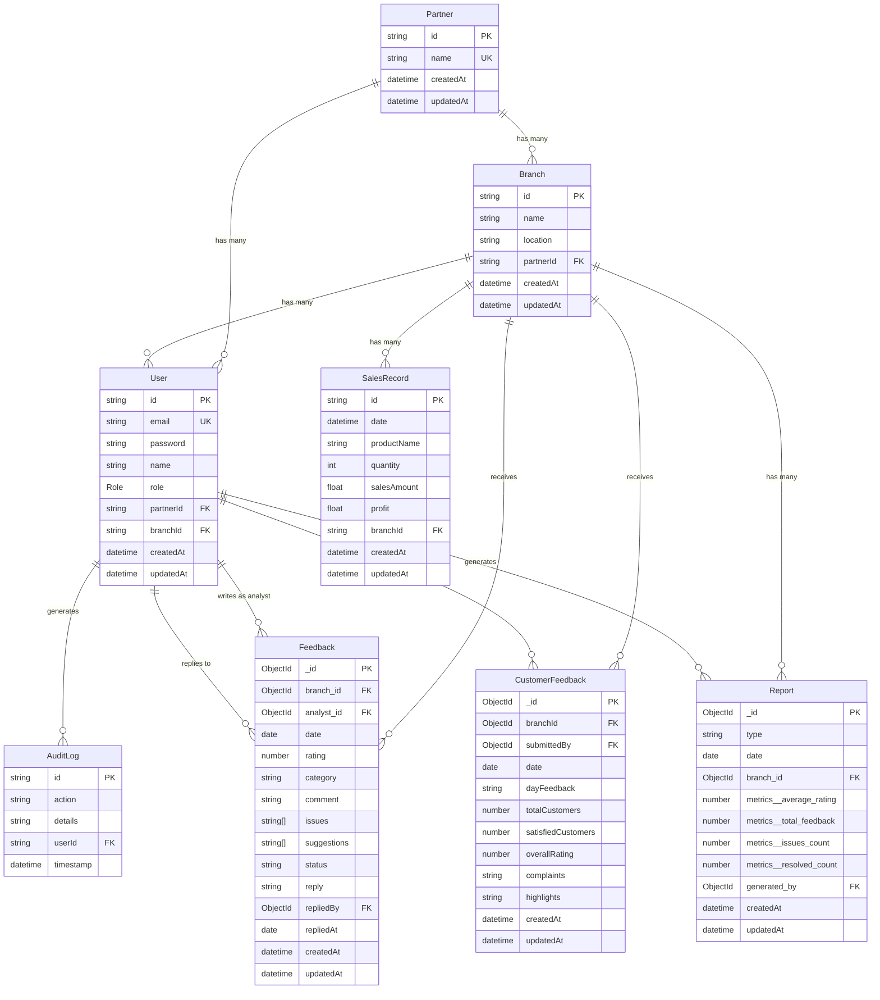

# Partnership Insights Hub — ER Diagram

## Entity-Relationship Diagram

## Relationships Summary

| Relationship | Type | Description |
|---|---|---|
| Partner → Branch | One-to-Many | A partner owns multiple branches |
| Partner → User | One-to-Many | A partner has multiple associated users |
| Branch → User | One-to-Many | A branch can have multiple users assigned |
| Branch → SalesRecord | One-to-Many | A branch records many sales transactions |
| Branch → Feedback | One-to-Many | A branch receives analyst feedback |
| Branch → CustomerFeedback | One-to-Many | A branch receives daily partner feedback |
| Branch → Report | One-to-Many | Reports are generated per branch |
| User → AuditLog | One-to-Many | User actions are logged |
| User → Feedback | One-to-Many | An analyst writes feedback; a user can reply |
| User → CustomerFeedback | One-to-Many | A partner user submits daily feedback |
| User → Report | One-to-Many | A user generates reports |

## Notes

- **Dual database**: The project uses **Prisma/SQLite** for core entities (`User`, `Partner`, `Branch`, `SalesRecord`, `AuditLog`) and **Mongoose/MongoDB** for feedback & reporting (`Feedback`, `CustomerFeedback`, `Report`).
- **Role** is an enum: `ANALYST` or `PARTNER`.
- **SalesRecord** has a composite unique constraint on `(date, branchId, productName)`.
- **Feedback.category** is an enum: `sales`, `performance`, `communication`, `compliance`.
- **Report.type** is an enum: `daily`, `weekly`, `monthly`.
